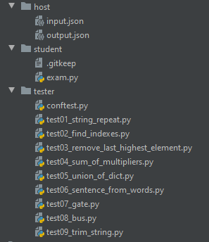

# Developing Arete's sub testers

Sub tester will get an input in the following fashion:



If you want to send files to students' mail then write the files to `/host/` folder but make sure that the name of the file won't be either `input.json` nor `output.json`!

Where ```input.json``` will have content similar to:
```
{
  "contentRoot": "/student",
  "testRoot": "/tester",
  "extra": "stylecheck"
}
```

contentRoot - student files
testRoot - test files
extra - some extra parameters for tester. Comma separated.

It is recommended, that your tester returns the response with [this structure](../schemas/arete/response/responseSchema.json) and place the result into ```output.json```

Where the type must be: ```arete```

Few examples as follows: (```Sub tester response``` parsed into ```Arete response```)

[Java tester - exam](../schemas/tester/java-arete.json) to [Arete response](../schemas/arete/example-java-exam.json)

[Java tester - failed](../schemas/tester/java-failed-arete.json) to [Arete response](../schemas/arete/example-java.json)

[Python tester - successful](../schemas/tester/python-arete.json) to [Arete response](../schemas/arete/example-python.json)

