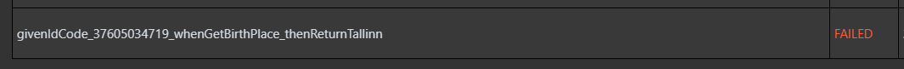
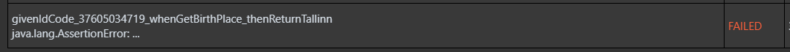
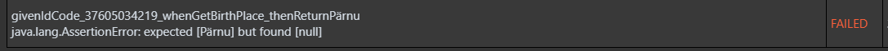

# Handling Arete's subtesters

Currently availabe subtesters are visible [here at docker repository](https://hub.docker.com/search?q=automatedtestingservice&type=image)

## Webhooks

Add a following webhook to tests repository to run tests after teacher pushes to validate tests:
 - URL: https://cs.ttu.ee/services/arete/api/v2/exercise
 - Secret Token: <permission_group> <permission_group_token>
 - Make sure arete.json contains `programmingLanguage` and `solutionsRepository`

Add a following webhook to solutions repository to run tests after teacher pushes his/her own solution:
 - URL: https://cs.ttu.ee/services/arete/api/v2/submission/:webhook/withTests?testRepository=<tests_repository> where <tests_repository> can be git@gitlab.cs.ttu.ee:iti0102-2020/ex.git for example
 - Secret Token: <permission_group> <permission_group_token>


## Usage

First make sure you have the latest version installed. You can use [arete front](https://gitlab.cs.ttu.ee/testing/arete-ui) to do so.

you can place arete.json file in the root of the repository("/") or grouping folder("/EXAM/") or exercise("/EXAM/exam1/") in either tests repository or student repository for customised testing.

Features, that students can use are marked with double asterix**

Example:
````json
{
  "dockerTimeout": 120,
  "dockerExtra": "stylecheck",
  "systemExtra": [
    "noMail",
    "noTesterFiles",
    "noStudentFiles",
    "noStd",
    "minimalFeedback"
  ],
  "groupingFolders": ["KT", "TK", "EXAM"],
  "solutionsRepository": "https://gitlab.cs.ttu.ee/iti0102-2020/ex",
  "testingPlatform": "python"
}
````

```dockerTimeout``` - Maximum allowed code execution time

```dockerExtra``` - Every subtester has different ones (seek subtester repository for more)

   * ```stylecheck``` - Check style in Python tester

   * ```-r TESTNG,COMPILER,CHECKSTYLE,FILEWRITER,REPORT``` - Check style in Java tester

```systemExtra``` - More testing specifics

   * ```anonymous``` - Nothing is sent to arete backend (Use with caution)
   
   * ```allowAppending``` - All extra parameters what are collections - instead of overriding, append 
   
   * ```giveTestRunnerControl``` - Allow tester setting slug and timestamp. Useful when integrating against external API
   
   * ```overrideContentRoot``` - Allow student changing content root which is being sent to tester (Use with caution)
      
   * ```overrideTestRoot``` - Allow student changing test root which is being sent to tester (Use with caution)
         
   * ```overrideExtra``` - Allow student changing extra which is being sent to tester (Use with caution)
   
   * ```overrideTestingPlatform``` - Allow student changing which tester is being used (Use with caution)
   
   * ```noOverall``` - Overall section in HTML is not shown

   * ```skipCopyingTests``` - Skip copying test to tester - also skips
   
   * ```skipCopyingStudent``` - Skip copying student files to tester

   * ```skipCopying``` -  ```skipCopyingTests``` and ```skipCopyingStudent``` combined

   * ```noMail``` - Student doesn't get a mail with testing results**
   
   * ```noFiles``` - No files are returned from testing
   
   * ```noTesterFiles``` - No test files are returned from testing
   
   * ```noStudentFiles``` - No student files are returned from testing
   
   * ```noStd``` - Test container logs are not returned from testing
   
   * ```noStyle``` - Mail won't containt any style related fields and all traces of any stylecheck will be removed from return json
   
   * ```allowExternalMail``` - Mail will ve sent to external mails like @gmail.com. Without parameters @taltech.ee and @ttu.ee are only valid options 
   
   * ```noOverride``` - Don't let arete.json files override existing parameters
   
   * ```noFeedback``` - 
   
   * ```minimalFeedback``` - 
   
   Otherwise student sees the following: 

```groupingFolders``` - Folders which are not slugs themselves but contain slugs. Note: students still need to have the same file tree for testing to be successful

```solutionsRepository``` - Repository which contains solutions against what tests are ran after being updated.

```testingPlatform``` - Programming language - used to determine tester
